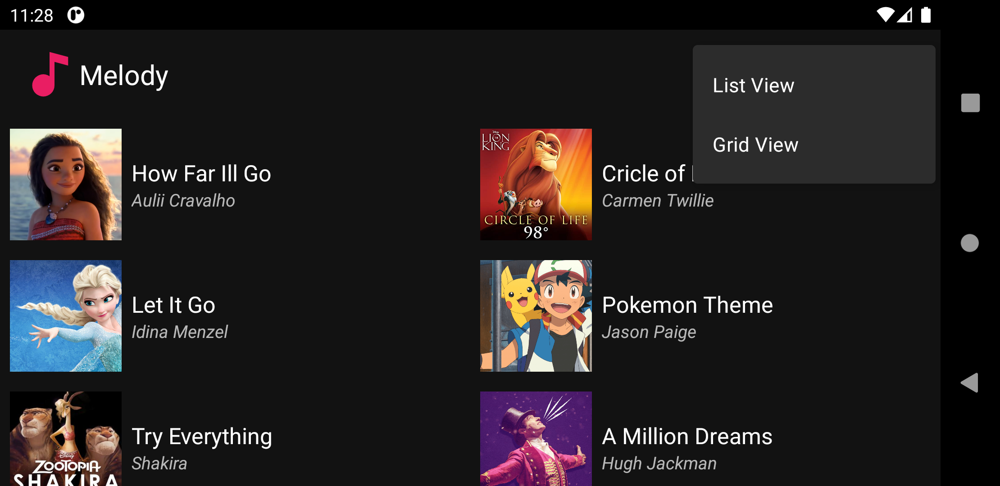

# Melody - Music Listing App


## What is Meldoy?
Melody is a Android application created as a part of the course - CS478 Software Development for Mobile Platforms under Professor Dr.Ugo Buy. 

Project Requirement can be found [here](./Project_Requirements.pdf).

## Specification
- Android 11 - API Level 30

## Functionality
- Melody App lists select popular songs with a thumbnail, song title and artist name.
- Clicking on the song item will take the user to the song's YouTube page.\
- Long clicking the song list item will open a popup menu and provides 3 choices to the user.
    1. Play Song.
    2. Open Artist Wiki.
    3. Open Song Wiki.

    Selecting the wiki pages will take the user to the respective wiki page on the mobile browser.
- User can switch between List and Grid view.
- User can switch the preference - Light or Dark mode, and the app will change themes automatically.
## How to build it?
1. Download or clone this repository using the command
```
git clone https://github.com/laxmena/Melody-MusicApp.git
```
2. Launch _Android Studio_ and select _Open existing Android Studio Project_, then select __Melody-MusicApp__ project in the file browser.
3. Build and run the application using emulator or physical device.

## App Screenshots

**Light mode**

<table>
    <tr>
        <td>
            
        </td>
        <td>
            
        </td>
    </tr>
</table>

**Dark Mode**

<table>
    <tr>
        <td>
        GridView + Dark Mode + Landscape Orientation <br/>
        
        </td>
    </tr>
</table>

## Additional Information
If you have any additional questions, feedbacks, suggestions or recommendations, feel free to contact me through [Email](mailto:WriteTo@laxmena.com) or [LinkedIn](https://www.linkedin.com/in/lakshmanan-meiyappan/).

Visit my website here: [https://laxmena.com](http://laxmena.com/).